# LAB 3.4A (Java) : Kafka Metrics Dashboard - Observability

## ⏱️ Estimated Duration: 60-90 minutes

## 🏦 E-Banking Context

In a production banking system, **observability is critical** for:

- ❌ **Cluster health monitoring** - Are all brokers running?
- ❌ **Consumer lag tracking** - Are consumers keeping up?
- ❌ **Topic metadata** - Partition distribution, replication factors
- ❌ **Performance metrics** - Throughput, latency, error rates
- ❌ **Alerting** - Proactive issue detection

This lab builds a **metrics dashboard** that exposes Kafka cluster health via REST APIs and Prometheus metrics.

---

## 📊 Architecture

### Metrics Collection Pipeline

```mermaid
flowchart TB
    subgraph Kafka["🔥 Kafka Cluster"]
        B1["📦 Broker 1"]
        B2["📦 Broker 2"]
        B3["📦 Broker 3"]
        T1["📋 Topics"]
        CG["👥 Consumer Groups"]
    end

    subgraph MetricsApp["🚀 Metrics Dashboard (Java)"]
        ADMIN["AdminClient"]
        CTRL["MetricsController"]
        SVC["KafkaMetricsService"]
        PROM["Micrometer + Prometheus"]
    end

    subgraph Consumers["📥 Monitoring Systems"]
        GRAF["📉 Grafana"]
        PROM_SRV["📈 Prometheus Server"]
        ALERT["⚠️ AlertManager"]
        API["🔍 REST API Clients"]
    end

    ADMIN --> B1
    ADMIN --> B2
    ADMIN --> B3
    ADMIN --> T1
    ADMIN --> CG
    
    SVC --> ADMIN
    CTRL --> SVC
    PROM --> SVC
    
    PROM --> PROM_SRV
    PROM_SRV --> GRAF
    PROM_SRV --> ALERT
    CTRL --> API
```



---

## 🏗️ Project Structure

```
java/
├── src/main/java/com/data2ai/kafka/metrics/
│   ├── MetricsDashboardApplication.java   # Spring Boot main class
│   ├── controller/
│   │   ├── RootController.java              # Root endpoint
│   │   └── MetricsController.java           # REST endpoints
│   └── service/
│       └── KafkaMetricsService.java          # AdminClient operations
├── src/main/resources/
│   └── application.properties               # Configuration
└── pom.xml                                 # Maven dependencies
```

---

## 🚀 Quick Start

### Prerequisites

- Java 17+
- Maven 3.6+
- Kafka cluster running
- OpenShift Sandbox (for deployment)

### Local Development

```bash
# Build and run locally
mvn clean spring-boot:run

# Check cluster health
curl http://localhost:8080/api/v1/metrics/cluster

# List topics
curl http://localhost:8080/api/v1/metrics/topics

# Check consumer groups
curl http://localhost:8080/api/v1/metrics/consumers

# Prometheus metrics
curl http://localhost:8080/actuator/prometheus
```

### OpenShift Deployment

```bash
# Deploy using scripts
cd ../../scripts
./bash/deploy-and-test-3.4a-java.sh --token "sha256~XXX" --server "https://api..."

# Or using PowerShell
./powershell/deploy-and-test-3.4a-java.ps1 -Token "sha256~XXX" -Server "https://api..."
```

---

## 📋 API Endpoints

| Method | Endpoint | Description | Response |
|--------|----------|-------------|----------|
| GET | `/` | Application info | JSON with endpoints |
| GET | `/actuator/health` | Health check | UP/DOWN status |
| GET | `/actuator/prometheus` | Prometheus metrics | Text format |
| GET | `/api/v1/metrics/cluster` | Cluster health | Brokers, controller |
| GET | `/api/v1/metrics/topics` | Topic metadata | List with details |
| GET | `/api/v1/metrics/consumers` | Consumer groups | Lag information |

---

## 🔧 Configuration

### application.properties

```properties
server.port=8080
spring.application.name=ebanking-metrics-dashboard

# Kafka
spring.kafka.bootstrap-servers=localhost:9092

# Actuator - expose all endpoints including prometheus
management.endpoints.web.exposure.include=health,info,prometheus,metrics
management.endpoint.health.show-details=always
management.metrics.export.prometheus.enabled=true
```

### Environment Variables (OpenShift)

| Variable | Default | Description |
|----------|---------|-------------|
| `SERVER_PORT` | 8080 | HTTP server port |
| `KAFKA_BOOTSTRAP_SERVERS` | localhost:9092 | Kafka brokers |

---

## 📊 API Responses

### Cluster Health

```bash
curl /api/v1/metrics/cluster
```

Response:
```json
{
  "status": "HEALTHY",
  "clusterId": "kafka-cluster-id",
  "brokerCount": 3,
  "controllerId": 1,
  "brokers": [
    {
      "id": 1,
      "host": "kafka-0.kafka-svc",
      "port": 9092,
      "rack": "none"
    }
  ]
}
```

### Topics

```bash
curl /api/v1/metrics/topics
```

Response:
```json
{
  "count": 5,
  "topics": [
    {
      "name": "banking.transactions",
      "partitions": 3,
      "replicationFactor": 1,
      "internal": false
    }
  ]
}
```

### Consumer Groups

```bash
curl /api/v1/metrics/consumers
```

Response:
```json
{
  "count": 2,
  "groups": [
    {
      "groupId": "fraud-detection-service",
      "isSimple": false,
      "totalLag": 0,
      "partitions": [
        {
          "topic": "banking.transactions",
          "partition": 0,
          "committedOffset": 1234,
          "endOffset": 1234,
          "lag": 0
        }
      ]
    }
  ]
}
```

---

## 📈 Prometheus Metrics

The application exposes metrics at `/actuator/prometheus`:

### Application Metrics

```
# Application health status
application_health_status 1.0

# API request counts
http_requests_total{method="GET",uri="/api/v1/metrics/cluster",status="200"} 42.0

# AdminClient operation duration
kafka_admin_operation_duration_seconds{operation="describeCluster",success="true"} 0.125
```

### JVM Metrics

```
# Memory usage
jvm_memory_used_bytes{area="heap"} 134217728.0

# GC metrics
jvm_gc_pause_seconds{action="end of major GC"} 0.025
```

### Custom Metrics

You can add custom metrics:

```java
@Component
public class CustomMetrics {
    private final Counter consumerLagCounter;
    
    public CustomMetrics(MeterRegistry meterRegistry) {
        this.consumerLagCounter = Counter.builder("kafka_consumer_lag_total")
            .description("Total consumer lag")
            .register(meterRegistry);
    }
    
    public void recordLag(long lag) {
        consumerLagCounter.increment(lag);
    }
}
```

---

## 🔍 Monitoring Setup

### Prometheus Configuration

```yaml
# prometheus.yml
scrape_configs:
  - job_name: 'kafka-metrics'
    static_configs:
      - targets: ['ebanking-metrics-java-secure.apps.mycluster.com:443']
    scheme: https
    tls_config:
      insecure_skip_verify: true
```

### Grafana Dashboard

Create a dashboard with panels for:

1. **Cluster Health**: Broker count, controller status
2. **Consumer Lag**: Total lag per consumer group
3. **Topic Metrics**: Partition count, replication factors
4. **API Performance**: Request rate, error rate, latency

### Alerting Rules

```yaml
# alerts.yml
groups:
  - name: kafka
    rules:
      - alert: KafkaBrokerDown
        expr: kafka_broker_count < 3
        for: 5m
        labels:
          severity: critical
        annotations:
          summary: "Kafka broker is down"
      
      - alert: HighConsumerLag
        expr: kafka_consumer_lag_total > 1000
        for: 2m
        labels:
          severity: warning
        annotations:
          summary: "High consumer lag detected"
```

---

## 🧪 Testing

### Unit Tests

```bash
mvn test
```

### Integration Tests

```bash
# Test with Testcontainers
mvn test -Dtest=**/*IntegrationTest
```

### Manual Testing

```bash
# Test all endpoints
for endpoint in cluster topics consumers; do
  echo "Testing /api/v1/metrics/$endpoint"
  curl -s "http://localhost:8080/api/v1/metrics/$endpoint" | jq .
done

# Test Prometheus format
curl -s http://localhost:8080/actuator/prometheus | head -20
```

---

## 🔧 AdminClient Operations

The `KafkaMetricsService` uses `AdminClient` for:

### Cluster Information

```java
DescribeClusterResult cluster = adminClient.describeCluster();
Collection<Node> nodes = cluster.nodes().get();
Node controller = cluster.controller().get();
String clusterId = cluster.clusterId().get();
```

### Topic Metadata

```java
Set<String> topicNames = adminClient.listTopics().names().get();
Map<String, TopicDescription> descriptions = 
    adminClient.describeTopics(topicNames).allTopicNames().get();
```

### Consumer Group Lag

```java
ListConsumerGroupsResult groups = adminClient.listConsumerGroups();
for (ConsumerGroupListing group : groups.all().get()) {
    Map<TopicPartition, OffsetAndMetadata> offsets = 
        adminClient.listConsumerGroupOffsets(group.groupId())
            .partitionsToOffsetAndMetadata().get();
    
    // Calculate lag by comparing with end offsets
}
```

---

## 🐛 Troubleshooting

| Issue | Cause | Solution |
|-------|-------|----------|
| `TimeoutException` | Kafka broker unreachable | Check `KAFKA_BOOTSTRAP_SERVERS` |
| `AuthenticationException` | SASL/SSL misconfiguration | Verify security settings |
| Empty consumer groups | No active consumers | Check consumer applications |
| `AuthorizationException` | Insufficient permissions | Grant required ACLs |
| High AdminClient latency | Network issues or broker load | Increase timeouts |

---

## 📚 Concepts Covered

- **AdminClient**: Kafka cluster management
- **Micrometer**: Metrics collection framework
- **Prometheus**: Metrics exposition and monitoring
- **Consumer Lag**: Offset tracking and calculation
- **REST APIs**: Exposing metrics via HTTP
- **Health Checks**: Application and cluster health
- **Observability**: The three pillars (logs, metrics, traces)
